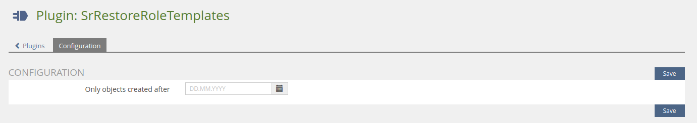

### Cron jobs

This plugin has the follow cron jobs:

- Reapply didactic templates to objects
- Reapply role templates to objects

### Config

#### Only objects created after

By default, the plugin will always process all objects (from latest to oldest)

You can configure a date to skip very old objects

### Per object

You can also run the jobs manually per object by using the [SrRestoreRoleTemplatesUI](https://github.com/studer-raimann/SrRestoreRoleTemplatesUI) plugin
